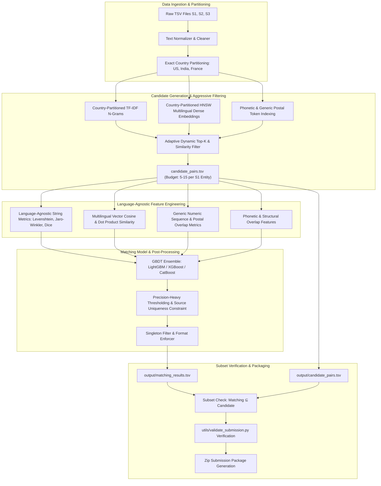

# MASTER IMPLEMENTATION PLAN V2: AMAZON ML CHALLENGE 2026 - BUSINESS ENTITY RESOLUTION

## 1. Executive Summary & Strategy Alignment (V2 Updates)

This master plan details the production-grade architecture, candidate-budgeted blocking strategy, language-agnostic feature engineering, and high-precision matching pipeline for the Amazon ML Challenge 2026.

### Key Strategy Adjustments in V2:
1. **Candidate Pool Budgeting & Audit Penalty Fix**:
   - **Audit Penalty Constraint**: Competition rules mandate that smaller candidate sets per Source 1 entity rank higher during final code audit evaluations beyond leaderboard score.
   - **Revised Target**: Replaced broad `<100 candidate` targets with a **strict average budget of 5–15 candidates per S1 entity** (hard ceiling of 20–25 candidates per S1 entity).
2. **Exact Country Hard-Blocking Partition**:
   - Hard-block candidates by exact country match (\(\text{country}(S2/S3) == \text{country}(S1)\)). Reduces search space by ~70% with **zero recall loss**.
3. **Open-Set Generalization for France**:
   - Eliminate country-specific regexes (e.g., US state lists, Indian PIN formats). Use language-agnostic feature extractors and multilingual transformer embeddings (`BAAI/bge-m3`, `sentence-transformers/paraphrase-multilingual-MiniLM-L12-v2`).
4. **Precision-Skewed \(F_{0.5}\) & Singleton Protection**:
   - High thresholding (\(\theta^* \approx 0.65 - 0.80\)) and source-level uniqueness constraints (max 1 match per source unless top probabilities are nearly identical) to safeguard 1.0 singleton scores.

---

## 2. Pipeline & System Architecture



---

## 3. Phase-by-Phase Implementation Plan

### Phase 1: Infrastructure, EDA & Validation Setup
- **Git Branch & Repo Management**:
  - Active development on branch `Tung_code`.
  - Remote origin set to `https://github.com/TungDucVu/Amazon-ML-Challenge.git`.
- **Data Loaders & Tab-Separator Safeguards**:
  - Enforce explicit `sep="\t"` parsing in pandas/polars readers.
  - Implement schema check for columns (`entity_id`, `business_name`, `business_address`, `country`).
- **Validation Split Strategy**:
  - 80/20 train/validation split stratified by country (`US`, `India`) and match cardinality (singletons vs multi-match).
  - Implement local Macro \(F_{0.5}\) evaluation harness matching official leaderboard metric.

### Phase 2: Budget-Constrained & High-Recall Blocking (Target: 5–15 Candidates/S1)
- **Stage 2.1: Exact Country Hard-Blocking Partition**:
  - Restrict candidate matching strictly within the same country partition:
    \[ Candidates(S1_i) \subseteq \{ S2, S3 \mid \text{country} = \text{country}(S1_i) \} \]
  - Reduces candidate search space by 66%–75% with zero recall penalty.
- **Stage 2.2: Multilingual Dense Vector Search (FAISS / HNSW)**:
  - Generate embeddings for `[country + business_name + business_address]` using open-source, MIT/Apache 2.0 multilingual models (`BAAI/bge-m3` or `sentence-transformers/paraphrase-multilingual-MiniLM-L12-v2`).
  - Perform HNSW nearest-neighbor search per country partition.
- **Stage 2.3: Sparse TF-IDF & Generic Token Indexing**:
  - Character 3-gram & word 1-2 gram TF-IDF cosine retrieval within country partitions.
  - Generic 4–6 digit postal/numeric token exact match index.
- **Stage 2.4: Adaptive Dynamic Top-K Filtering**:
  - Instead of static top-30 per source, apply dynamic score thresholding:
    \[ \text{Include candidate if } \text{similarity} > 0.45 \text{ OR } \text{rank} \le 5 \]
  - Cap maximum candidates per S1 entity at 20–25 (achieving an average of **5–15 candidates per S1 entity** across the dataset).
  - Export final candidate set to `output/candidate_pairs.tsv`.

### Phase 3: Language-Agnostic Feature Engineering (Unseen Country Generalization)
For each `(Source 1, Candidate)` pair in `candidate_pairs.tsv`, compute features designed to transfer seamlessly to `France`:
- **Language-Agnostic String Features**:
  - Normalized Levenshtein distance, Damerau-Levenshtein distance.
  - Jaro-Winkler similarity.
  - Character 3-gram / 4-gram Dice coefficient & Jaccard overlap.
  - Token sort ratio & Token set ratio (`RapidFuzz`).
- **Numeric & Structural Address Features**:
  - Numeric sequence match percentage (compares all digits extracted from address fields).
  - Generic postal token match flag (any isolated 4–6 digit number match).
  - Street token Jaccard overlap (handles *Rue*, *Boulevard*, *Avenue*, *Road*, *Street* uniformly).
- **Multilingual Semantic Embeddings**:
  - Cosine distance and dot product using multilingual embeddings (`BAAI/bge-m3` / `paraphrase-multilingual-MiniLM-L12-v2`).
- **Strict Prohibition**: No hardcoded country regexes (no US state codes, no Indian state/PIN specific lookup dictionaries).

### Phase 4: Machine Learning Matching Classifier & Threshold Optimization
- **Ensemble Model**: GBDT models (**LightGBM**, **XGBoost**, **CatBoost**).
- **Precision-Weighted Threshold Calibration**:
  - Because \(F_{0.5}\) weights precision 2x over recall, tune decision threshold \(\theta^*\) high on the validation set (\(\theta^* \approx 0.65 - 0.80\)).
- **Relative Margin & Source Uniqueness Constraints**:
  - **Source-level match limit**: In real-world ER, a Source 1 entity rarely matches multiple records from the same source file. Enforce at most 1 match per source file (S2 / S3) unless top candidate probabilities are within a tiny margin (\(\Delta < 0.03\)).
  - **Singleton Safeguard**: If top candidate probability is below \(\theta^*\), output empty match string `""`.

### Phase 5: Post-Processing, Verification & Memory Optimization
- **Subset Enforcement Script**:
  - Verify that every ID in `matching_results.tsv` is strictly a subset of `candidate_pairs.tsv`:
    \[ \text{IDs in } \texttt{matching\_results.tsv} \subseteq \text{IDs in } \texttt{candidate\_pairs.tsv} \]
- **Local Validator Execution**:
  - Run standard validation tool:
    ```bash
    python3 utils/validate_submission.py \
      --matching output/matching_results.tsv \
      --candidate output/candidate_pairs.tsv \
      --test-dir dataset/test
    ```
- **Memory & Batching Footprint**:
  - Optimize batch sizes for FAISS search and transformer feature extraction to prevent RAM swapping on standard competition hardware.

### Phase 6: Submission Packaging & Deliverables
- Self-contained code under `code/business_entity_resolution/src/`.
- Pinned `requirements.txt` and reproducible `README.md`.
- Filled methodology document `Documentation_template.md`.
- Final package zip `<team_name>_submission.zip`.

---

## 4. Key Milestones & Roadmap (V2)

| Milestone | Deliverable | Status |
|---|---|---|
| **M0 (Done)** | Requirements V2 (`REQUIREMENT_V2.txt`), Master Plan V2 (`MASTER_PLAN_V2.md`), `Tung_code` Git branch | Completed |
| **M1** | Data ingestion, country partitioning, local 80/20 validation split with F_0.5 evaluator | Pending |
| **M2** | Budgeted candidate blocking (exact country partition + dynamic top-K -> 5–15 candidates/S1) | Pending |
| **M3** | Language-agnostic feature engineering pipeline (multilingual embeddings + digit/string metrics) | Pending |
| **M4** | GBDT model training, high-threshold calibration (\(\theta^* \approx 0.65-0.80\)), source uniqueness constraint | Pending |
| **M5** | Validation harness execution, subset check, `utils/validate_submission.py` PASS verification | Pending |
| **M6** | Final zip submission package creation | Pending |

---

## 5. Compliance & Quality Assurance Checklist

- [x] Created `Tung_code` Git branch.
- [x] Master Plan V2 & Requirement V2 updated with candidate pool efficiency budget (5–15 candidates/S1).
- [ ] Country hard-blocking partition implemented (\(\text{country}(S2/S3) == \text{country}(S1)\)).
- [ ] Multilingual embeddings (`BAAI/bge-m3` or `paraphrase-multilingual-MiniLM-L12-v2`) integrated for language-agnostic transfer to France.
- [ ] Subset condition enforced: \(\text{IDs in } \texttt{matching\_results.tsv} \subseteq \text{IDs in } \texttt{candidate\_pairs.tsv}\).
- [ ] `utils/validate_submission.py` passes with zero warnings or errors.
